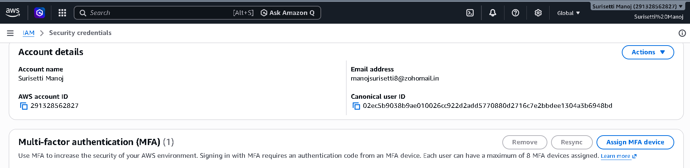
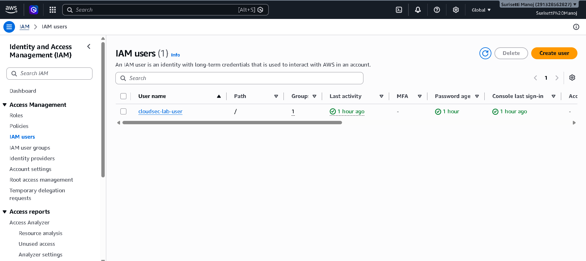
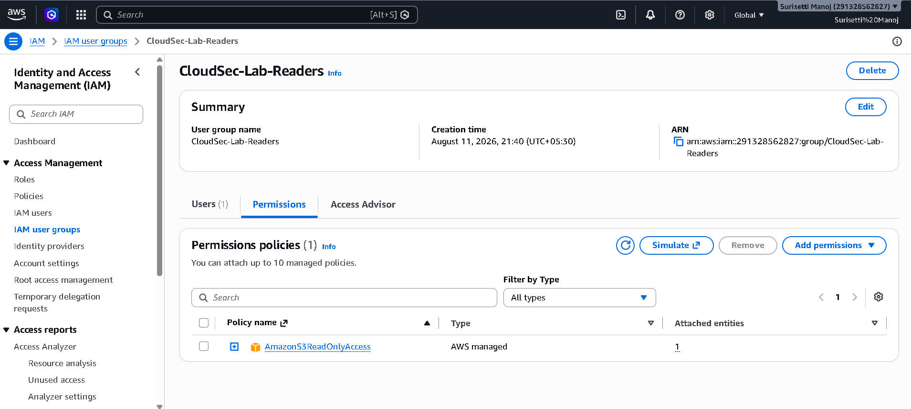
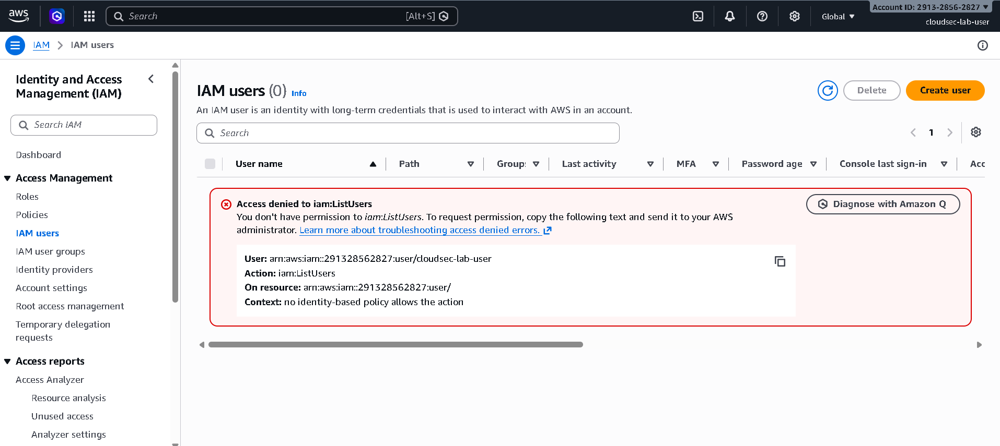
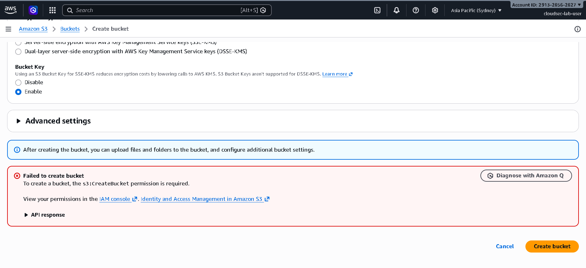

# AWS IAM — Users, Groups & Least Privilege 🔐

## Objective

Understand AWS Identity and Access Management (IAM) and demonstrate
the Principle of Least Privilege through a practical hands-on AWS lab.

---

## Concepts Learned

### Authentication

Authentication answers:

> **Who are you?**

In AWS, authentication verifies the identity attempting to access
the AWS environment.

### Authorization

Authorization answers:

> **What are you allowed to do?**

After authentication, AWS evaluates whether the identity has
permission to perform the requested action.

### Authentication vs Authorization

```text
Authentication
      ↓
"Who are you?"
      ↓
Authorization
      ↓
"What are you allowed to do?"


AWS Account
     │
     ↓
IAM User
cloudsec-lab-user
     │
     ↓
IAM Group
CloudSec-Lab-Readers
     │
     ↓
Managed Policy
AmazonS3ReadOnlyAccess
The IAM user receives permissions through the IAM group rather than having the policy attached directly to the user.

Implementation
1. Secured the AWS Root Account
Before creating IAM resources, the AWS root account was secured with:

Multi-Factor Authentication (MFA) enabled

Billing protection configured

A zero-spend budget created

Account access verified

2. Created IAM User
Created a dedicated IAM user (cloudsec-lab-user) for the hands-on security lab:

AWS Management Console access enabled

Autogenerated initial password with a required change at first login

No long-lived AWS access keys created

3. Created IAM Group & Policy
Group: CloudSec-Lab-Readers (used to centrally manage permissions instead of attaching policies individually).

Policy: Attached the AWS managed policy AmazonS3ReadOnlyAccess to the group to provide read-oriented S3 permissions while avoiding unnecessary administrative access.

# Screenshots

## 1. AWS Root Account — MFA Enabled

MFA was enabled on the AWS root account before beginning
the IAM lab.



---

## 2. IAM User Created

Created the dedicated IAM user:

`cloudsec-lab-user`



---

## 3. IAM Group and S3 Read-Only Policy

The user receives S3 read-only permissions through the
`CloudSec-Lab-Readers` group.



---

## 4. IAM Authorization Test

Attempting to access IAM Users resulted in:

`AccessDenied`



---

## 5. S3 Authorization Test

Attempting to access S3 Table Buckets resulted in:

`s3tables:ListTableBuckets` → `AccessDenied`



Testing & Results
Test 1 — IAM Authorization
Action: Attempted to access the IAM Users list via the console.

Result: AccessDenied (iam:ListUsers)

Observation: The user was successfully authenticated into AWS but was not authorized to perform the requested IAM operation.

Test 2 — S3 Authorization
Action: Explored S3 and attempted to access S3 Table Buckets.

Result: AccessDenied (s3tables:ListTableBuckets)

Observation: Even though AmazonS3ReadOnlyAccess was attached, access to S3 Table Buckets involves a separate API namespace (s3tables), demonstrating that AWS evaluates permissions at the individual API-action level.

Security Analysis
Principle of Least Privilege
Instead of granting broad permissions like AdministratorAccess, the user was given only the permissions required for the learning objective:

Give an identity only the permissions required to perform its intended tasks.

Reduced Blast Radius
If an identity with excessive permissions is compromised, the potential impact is massive. Restricting permissions limits the available actions and reduces the overall blast radius:

Plaintext
Compromised Identity → Limited Permissions → Limited Available Actions → Reduced Blast Radius
Key Takeaways
Authentication and authorization are separate concepts.

IAM controls access to AWS resources using users, groups, policies, and roles.

Permissions should always follow the Principle of Least Privilege.

AWS evaluates permissions against specific API actions.

AccessDenied indicates that the requested operation was not authorized under the applicable policies.

Root users should never be used for everyday operations, and MFA is mandatory for security best practices.

What I Learned

The most important practical lesson from this lab was that
having access to an AWS account does not mean having access
to every AWS operation.

AWS evaluates the identity, applicable policies, requested
action, resource, and relevant conditions before allowing
or denying an operation.

The hands-on tests made the difference between authentication
and authorization clear:
Authentication
      ↓
Identity verified
      ↓
Authorization
      ↓
Permission evaluated
      ↓
   ┌───────────────┐
   ↓               ↓
ALLOW            DENY
   ↓               ↓
Action          AccessDenied

Lab Outcome

Successfully created and tested a basic AWS IAM environment
using a least-privilege approach.

The lab demonstrated:

Authentication
      ↓
Identity verified
      ↓
Authorization
      ↓
Permission evaluated
      ↓
   ┌───────────────┐
   ↓               ↓
ALLOW            DENY
   ↓               ↓
Action          AccessDenied