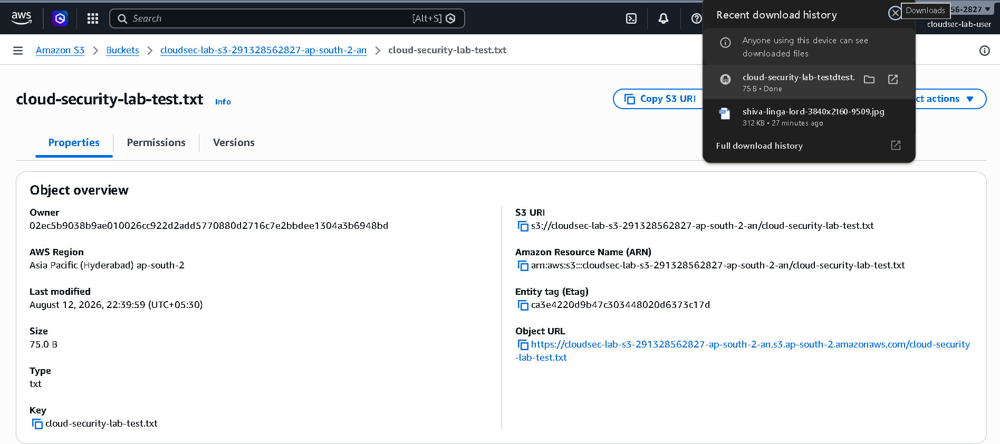
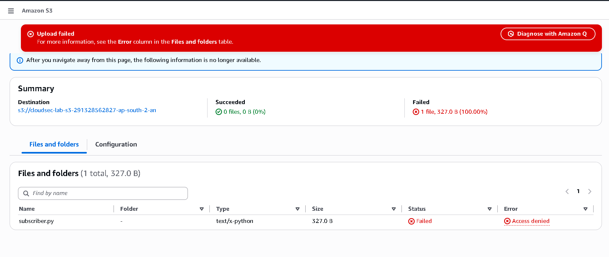
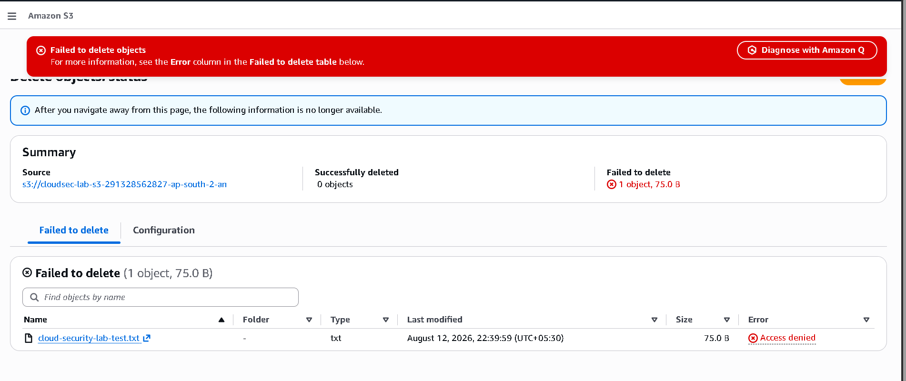

# Amazon S3 — Secure Object Storage & Access Control 🔐

## Objective

Understand Amazon Simple Storage Service (S3) and demonstrate
secure object storage and IAM-based access control through a
practical hands-on AWS lab.

The lab focuses on:

- S3 bucket configuration
- Object storage
- Block Public Access
- Object encryption
- Bucket versioning
- IAM-based access control
- Read-only access
- Testing unauthorized write and delete operations
- Principle of Least Privilege

---

## Concepts Learned

### Amazon S3

Amazon S3 is an object storage service used to store and retrieve
data as objects inside buckets.

The basic S3 structure is:

```text
AWS Account
     │
     ↓
S3 Bucket
     │
     ├── Object
     │     └── cloud-security-lab-test.txt
     │
     └── Object Metadata
```

---

## S3 Security Model

Access to an S3 object can be controlled using multiple mechanisms,
including IAM policies, bucket policies, access control settings,
and public access protection.

For this lab, access was controlled primarily through IAM.

```text
IAM User
    │
    ↓
IAM Group
CloudSec-Lab-Readers
    │
    ↓
AmazonS3ReadOnlyAccess
    │
    ↓
S3 Bucket
    │
    ├── Read    → ALLOW
    ├── Upload  → DENY
    └── Delete  → DENY
```

---

# Implementation

## 1. Created S3 Bucket

Created an S3 bucket in:

```text
Region: Asia Pacific (Hyderabad)
Region Code: ap-south-2
```

The bucket was created using the AWS S3 console.

The bucket name was automatically generated using the account
regional namespace.

Example:

```text
cloudsec-lab-s3-291328562827-ap-south-2-an
```

---

## 2. Object Ownership

The bucket was configured with:

```text
Object Ownership:
Bucket owner enforced

ACLs:
Disabled
```

Disabling ACLs simplifies access management by relying on
IAM and bucket policies instead of legacy object ACLs.

---

## 3. Block Public Access

S3 Block Public Access was enabled.

```text
Block all public access
        ↓
Public access blocked
```

This provides an additional protection layer against accidental
public exposure of bucket data.

For this security lab, no public access was required.

---

## 4. Bucket Versioning

Bucket Versioning was enabled.

```text
Versioning
     ↓
Multiple versions of objects can be retained
     ↓
Protection against accidental modification/deletion
```

Versioning can help recover previous versions of objects and
provides an additional layer of data protection.

---

## 5. Default Encryption

Server-side encryption was enabled using:

```text
SSE-S3
Amazon S3 managed keys
```

This ensures that newly stored objects are encrypted at rest.

```text
Object
   ↓
S3
   ↓
Server-Side Encryption
   ↓
Encrypted Object
```

---

# 6. Uploaded Test Object

A test object was uploaded to the bucket:

```text
cloud-security-lab-test.txt
```

The object was successfully stored in the S3 bucket.

The IAM user was then used to test whether the configured
permissions actually enforced the intended access boundary.

---

# IAM Access Control

The IAM user created during the previous IAM lab was used:

```text
cloudsec-lab-user
        │
        ↓
CloudSec-Lab-Readers
        │
        ↓
AmazonS3ReadOnlyAccess
```

The user was intentionally given read-only S3 permissions.

No administrative or full S3 access was granted.

---

# Testing & Results

## Test 1 — Read / Download Object

### Action

Logged into AWS using:

```text
cloudsec-lab-user
```

Opened the S3 bucket and downloaded:

```text
cloud-security-lab-test.txt
```

### Result

```text
SUCCESS ✅
```

The object could be accessed and downloaded successfully.

This demonstrated that the IAM policy permits the required
read operations.



---

## Test 2 — Upload Object

### Action

Attempted to upload a new object to the existing S3 bucket.

Example:

```text
subscriber.py
```

### Result

```text
Access Denied ❌
```

The upload failed because the IAM identity does not have the
required S3 write permission.

Conceptually:

```text
Upload
   ↓
s3:PutObject
   ↓
AmazonS3ReadOnlyAccess
   ↓
Permission not granted
   ↓
AccessDenied ❌
```



---

## Test 3 — Delete Object

### Action

Attempted to delete:

```text
cloud-security-lab-test.txt
```

using the IAM user.

### Result

```text
Access Denied ❌
```

The deletion failed because the IAM identity does not have
the required delete permission.

Conceptually:

```text
Delete
   ↓
s3:DeleteObject
   ↓
AmazonS3ReadOnlyAccess
   ↓
Permission not granted
   ↓
AccessDenied ❌
```



---

# Authorization Matrix

The practical tests produced the following result:

| Operation | Result |
|---|---|
| Access S3 | ✅ Allowed |
| View bucket | ✅ Allowed |
| Read object | ✅ Allowed |
| Download object | ✅ Allowed |
| Create bucket | ❌ Denied |
| Upload object | ❌ Denied |
| Delete object | ❌ Denied |

This demonstrates that authentication into AWS does not
automatically provide authorization to perform every operation.

---

# Security Analysis

## Principle of Least Privilege

The IAM user was given only the permissions required for
the intended learning objective.

Instead of granting:

```text
AdministratorAccess
```

or:

```text
AmazonS3FullAccess
```

the user was granted:

```text
AmazonS3ReadOnlyAccess
```

This significantly reduces the number of operations available
to the identity.

---

## Reduced Blast Radius

If the IAM identity were compromised, the attacker would not
automatically have permission to upload, modify, or delete
objects.

```text
Compromised Identity
        ↓
Limited Permissions
        ↓
Limited Available Actions
        ↓
Reduced Blast Radius
```

This is one of the fundamental principles of cloud security.

---

# Authentication vs Authorization

The lab demonstrated the difference between authentication
and authorization.

```text
Authentication
      ↓
Identity verified
      ↓
cloudsec-lab-user
      ↓
Authorization
      ↓
Requested S3 API action evaluated
      ↓
   ┌───────────────┐
   ↓               ↓
 ALLOW            DENY
   ↓               ↓
 Read            Upload
 Download        Delete
```

The user was successfully authenticated but was denied
operations for which the IAM policy did not provide permission.

---

# Key Takeaways

- S3 is an object storage service based on buckets and objects.
- S3 buckets should not be made public unless there is a specific requirement.
- Block Public Access provides an important protection against accidental exposure.
- Object ownership can be enforced through bucket-owner-enforced settings.
- S3 supports versioning for retaining multiple object versions.
- Server-side encryption protects objects at rest.
- IAM policies can restrict S3 operations at the API-action level.
- Read-only access does not imply write or delete access.
- `AccessDenied` is an important indicator that an authorization check failed.
- Least privilege reduces the potential blast radius of compromised identities.

---

# What I Learned

The most important lesson from this lab was that S3 access is
not simply "allowed" or "blocked."

AWS evaluates the specific operation being requested.

For example:

```text
Download Object
      ↓
Read Permission
      ↓
ALLOW ✅
```

while:

```text
Upload Object
      ↓
Write Permission
      ↓
Not Granted
      ↓
DENY ❌
```

and:

```text
Delete Object
      ↓
Delete Permission
      ↓
Not Granted
      ↓
DENY ❌
```

The practical tests made the concept of least privilege much
clearer than studying the IAM policy alone.

---

# Lab Outcome

Successfully created and secured an Amazon S3 bucket and tested
IAM-based access control using a dedicated IAM identity.

The lab demonstrated:

```text
                    S3 Security Lab
                          │
              ┌───────────┴───────────┐
              ↓                       ↓
          Configuration           IAM Access
              │                       │
      ┌───────┼────────┐              ↓
      ↓       ↓        ↓        ReadOnly Policy
   Version  Encryption  Block         │
   Control             Public         │
                      Access          │
                                      ↓
                         ┌────────────┴────────────┐
                         ↓                         ↓
                       READ                      WRITE
                         │                         │
                  ┌──────┴──────┐            ┌────┴────┐
                  ↓             ↓            ↓         ↓
               Download       Read        Upload     Delete
                  │             │            │         │
                  ✅            ✅           ❌         ❌
```

**Result: S3 access was successfully restricted according to
the Principle of Least Privilege.**