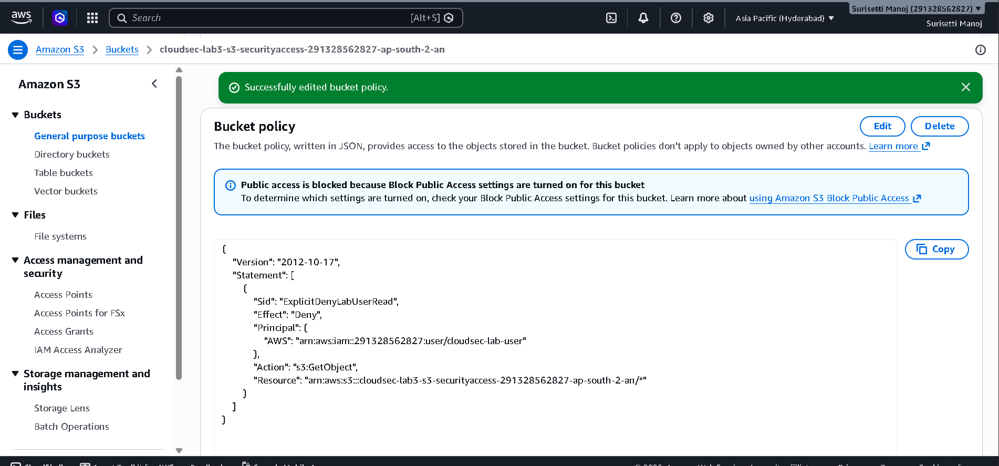
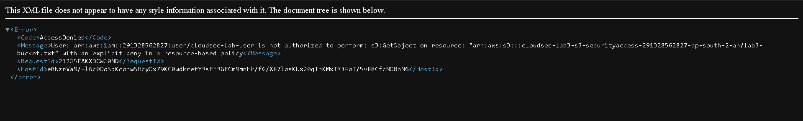

# Lab 3 — S3 Bucket Policies & Explicit Deny

## Objective

Understand how S3 bucket policies work with IAM policies and demonstrate how an explicit `Deny` affects access.

## Environment

- AWS Region: Asia Pacific (Hyderabad) - `ap-south-2`
- IAM User: `cloudsec-lab-user`
- IAM Group: `CloudSec-Lab-Readers`
- IAM Policy: `AmazonS3ReadOnlyAccess`
- S3 Bucket: Lab 3 security test bucket

## Concepts Covered

- Identity-based IAM policies
- S3 resource-based bucket policies
- Explicit Deny
- Allow vs Deny evaluation
- IAM policy vs S3 bucket policy
- Least privilege
- Temporary permission testing
- Permission cleanup

## Implementation

A separate S3 bucket was created for testing S3 bucket-level security policies.

The IAM user `cloudsec-lab-user` was already a member of the `CloudSec-Lab-Readers` group, which has the `AmazonS3ReadOnlyAccess` policy.

The existing policy allowed:

- `s3:GetObject`

It did not allow:

- `s3:PutObject`
- `s3:DeleteObject`

A test object was uploaded to the Lab 3 bucket for access testing.

## S3 Bucket Policy

A temporary S3 bucket policy was created with an explicit `Deny` for `s3:GetObject` targeting the `cloudsec-lab-user` IAM principal.



## Explicit Deny Test

The IAM policy allowed `s3:GetObject`, but the S3 bucket policy explicitly denied the same action.

The IAM user attempted to download the object and received `AccessDenied`.

AWS identified the cause as an explicit deny in a resource-based policy.



This demonstrated:

```text
IAM Policy
s3:GetObject → ALLOW
        +
S3 Bucket Policy
s3:GetObject → EXPLICIT DENY
        ↓
     ACCESS DENIED